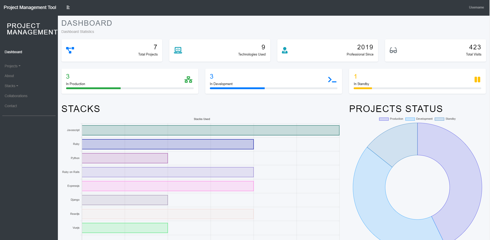
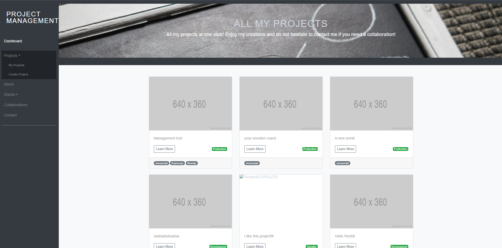
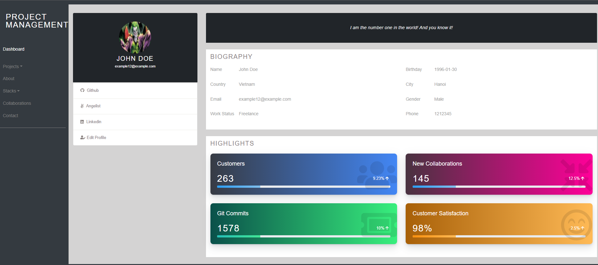
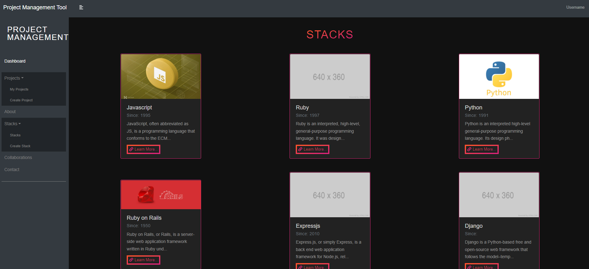

<!--
This README would normally document whatever steps are necessary to get the
application up and running.

Things you may want to c<!--
*** Thanks for checking out this README Template. If you have a suggestion that would
*** make this better, please fork the repo and create a pull request or simply open
*** an issue with the tag "enhancement".
*** Thanks again! Now go create something AMAZING! :D
-->

<!-- PROJECT SHIELDS -->
<!--
*** I'm using markdown "reference style" links for readability.
*** Reference links are enclosed in brackets [ ] instead of parentheses ( ).
*** See the bottom of this document for the declaration of the reference variables
*** for contributors-url, forks-url, etc. This is an optional, concise syntax you may use.
*** https://www.markdownguide.org/basic-syntax/#reference-style-links
-->
[![Contributors][contributors-shield]][contributors-url] 
[![Forks][forks-shield]][forks-url] 
[![Stargazers][stars-shield]][stars-url] 
[![Issues][issues-shield]][issues-url] 
 

# Project-Management-Tool-MERN

>  A MERN project to manage all your personal projects, might be used as portfolio as well. Built with MERN stack and Redux.

Additional description about the project and its features.

Dashboard:






## Built With

- MONGODB
- EXPRESS JS
- REACT
- NODE JS
- REDUX
- REACT-BOOTSTRAP
- EXPRESS-VALIDATOR
- MULTER
- ESLINT
- GITHUB ACTIONS
- VSCODE

## Getting Started
### Usage
To have this app on your pc, you need to:
* [download](https://github.com/javitocor/Project-Management-Tool-MERN/archive/main.zip) or clone this repo:
  - Clone with SSH:
  ```
    git@github.com:javitocor/Project-Management-Tool-MERN.git
  ```
  - Clone with HTTPS
  ```
    https://github.com/javitocor/Project-Management-Tool-MERN.git
  ```

* In the project directory, you can run:

Install dependencies in your home folder with:

``` bash
   npm install
```

Go to the './frontend' folder and install the frontend dependencies:
```
  npm install
```

And then:
```
  npm run build
```
Back to the home folder, run the server:

``` bash
   npm run devstart
```
Access the page by typing in your web browser

``` bash
   http://127.0.0.1:8000/
```

You can also run the app but running the server in one port and react in another, like so:
on the project root, run:
```
npm run devstart
```
on the frontend folder, run:
```
npm start
```
You can access the app by typing http://localhost:3000 in the browser.

## Information about the project
### Endpoints
```
  All CRUD operations to manage Profile, Projects and Stacks.
```
## Author

👤 Javier Oriol Correas Sanchez Cuesta 
- Github: [@javitocor](https://github.com/javitocor) 
- Twitter: [@JavierCorreas4](https://twitter.com/JavierCorreas4) 
- Linkedin: [Javier Oriol Correas Sanchez Cuesta](https://www.linkedin.com/in/javier-correas-sanchez-cuesta-15289482/) 

## 🤝 Contributing

Contributions, issues and feature requests are welcome!

Feel free to check the [issues page](https://github.com/javitocor/Project-Management-Tool-MERN/issues).

## Show your support

Give a ⭐️ if you like this project!

## Acknowledgments 🚀

- [Express Docs](https://expressjs.com/)
- [React Docs](https://reactjs.org/docs/getting-started.html)
- [Redux Docs](https://redux.js.org/)
- [React Bootstrap Docs](https://react-bootstrap.github.io/)
- [Multer Docs](https://github.com/expressjs/multer)
- [Express Validator Docs](https://express-validator.github.io/)
- [Mongoose Docs](https://mongoosejs.com/)

## 📝 License

This project is [MIT](lic.url) licensed.

<!-- MARKDOWN LINKS & IMAGES -->
<!-- https://www.markdownguide.org/basic-syntax/#reference-style-links -->
[contributors-shield]: https://img.shields.io/github/contributors/javitocor/Project-Management-Tool-MERN.svg?style=flat-square
[contributors-url]: https://github.com/javitocor/Project-Management-Tool-MERN/graphs/contributors
[forks-shield]: https://img.shields.io/github/forks/javitocor/Project-Management-Tool-MERN.svg?style=flat-square
[forks-url]: https://github.com/javitocor/Project-Management-Tool-MERN/network/members
[stars-shield]: https://img.shields.io/github/stars/javitocor/Project-Management-Tool-MERN.svg?style=flat-square
[stars-url]: https://github.com/javitocor/Project-Management-Tool-MERN/stargazers
[issues-shield]: https://img.shields.io/github/issues/javitocor/Project-Management-Tool-MERN.svg?style=flat-square
[issues-url]: https://github.com/javitocor/Project-Management-Tool-MERN/issuesover:
